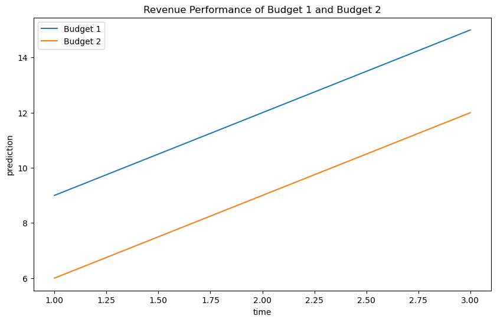

# budget_optimizer


<!-- WARNING: THIS FILE WAS AUTOGENERATED! DO NOT EDIT! -->

This library is to help wrap custom models for use in budget
optimization. It is designed to work with nested MMMs, where the budget
is allocated to different media channels and the performance is measured
by multiple KPIs which are fed into a downstream revenue model.

For example in a typical MMM, the budget is allocated to different media
channels and the performance is measured by sales, website visits, and
brand awareness. Website visits and brand awareness impact sales,
website visits are impacted by brand awareness. So the effects of
changing the budget flow through the nested KPIs.

The library is designed to work with any model that can be wrapped in a
`Model` class. The `Model` class should have needs a `predict` method
that takes a dictionary of parameters and returns an xarray dataset with
the model prediction for that model’s kpi. These model classes can be
composed in a `NestedModel` class which will flow the predictions into
the next stage of the model.

Model loading and functions to define how budget translates into model
inputs must be defined in a seperate file. Included in the folder with
the model artifacts in a file called `model_config.py` which should
contain the following functions:

- `model_loader` - a function that takes a path and returns a `Model`
  object
- `budget_to_model_inputs` - a function that a budget and model object
  and returns a dataset of model inputs

> [!NOTE]
>
> ### How to define the model_config.py file
>
> See the example in the `example_files` folder for an example of how to
> define these functions for a simple model.

## Developer Guide

If you are new to using `nbdev` here are some useful pointers to get you
started.

### Install budget_optimizer in Development mode

``` sh
# make sure budget_optimizer package is installed in development mode
$ pip install -e .

# make changes under nbs/ directory
# ...

# compile to have changes apply to budget_optimizer
$ nbdev_prepare
```

## Usage

### Installation

Install latest from the GitHub
[repository](https://github.com/redam94/budget_optimizer):

``` sh
$ pip install git+https://github.com/redam94/budget_optimizer.git
```

or from [conda](https://anaconda.org/redam94/budget_optimizer)

``` sh
$ conda install -c redam94 budget_optimizer
```

or from [pypi](https://pypi.org/project/budget_optimizer/)

``` sh
$ pip install budget_optimizer
```

### Documentation

Documentation can be found hosted on this GitHub
[repository](https://github.com/redam94/budget_optimizer)’s
[pages](https://redam94.github.io/budget_optimizer/). Additionally you
can find package manager specific guidelines on
[conda](https://anaconda.org/redam94/budget_optimizer) and
[pypi](https://pypi.org/project/budget_optimizer/) respectively.

## How to use

``` python
class RevenueModel(BaseBudgetModel):
    def __init__(self, model_name: str, model_kpi: str, model_path: str):
        super().__init__(model_name, model_kpi, model_path)
```

``` python
model = RevenueModel("Revenue Model", "Revenue", "../example_files/model_1")
budget_1 = dict(a=1, b=2)
budget_2 = dict(a=2, b=1)
outcome_budget_1 = model.predict(budget_1)
outcome_budget_2 = model.predict(budget_2)
```


