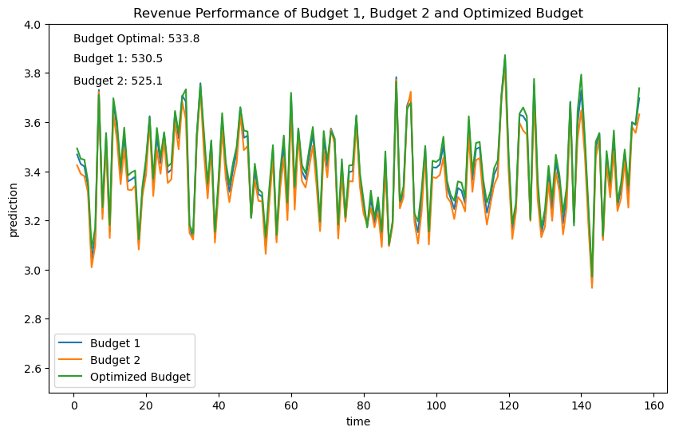

# budget_optimizer
Matthew Reda

<!-- WARNING: THIS FILE WAS AUTOGENERATED! DO NOT EDIT! -->

This library is to help wrap custom models for use in budget
optimization. It is designed to work with nested MMMs, where the budget
is allocated to different media channels and the performance is measured
by multiple KPIs which are fed into a downstream revenue model.

For example in a typical MMM, the budget is allocated to different media
channels and the performance is measured by sales, website visits, and
brand awareness. Website visits and brand awareness impact sales,
website visits are impacted by brand awareness. So the effects of
changing the budget flow through the nested KPIs.

The library is designed to work with any model that can be wrapped in a
`Model` class. The `Model` class should have needs a `predict` method
that takes a dictionary of parameters and returns an xarray dataset with
the model prediction for that model’s kpi. These model classes can be
composed in a `NestedModel` class which will flow the predictions into
the next stage of the model.

Model loading and functions to define how budget translates into model
inputs must be defined in a seperate file. Included in the folder with
the model artifacts in a file called `model_config.py` which should
contain the following functions:

- `model_loader` - a function that takes a path and returns a `Model`
  object
- `budget_to_model_inputs` - a function that a budget and model object
  and returns a dataset of model inputs

> [!NOTE]
>
> ### How to define the model_config.py file
>
> See the example in the `example_files` folder for an example of how to
> define these functions for a simple model.

## Developer Guide

If you are new to using `nbdev` here are some useful pointers to get you
started.

### Install budget_optimizer in Development mode

``` sh
# make sure budget_optimizer package is installed in development mode
$ pip install -e .

# make changes under nbs/ directory
# ...

# compile to have changes apply to budget_optimizer
$ nbdev_prepare
```

## Usage

### Installation

Install latest from the GitHub
[repository](https://github.com/redam94/budget_optimizer):

``` sh
$ pip install git+https://github.com/redam94/budget_optimizer.git
```

or from [pypi](https://pypi.org/project/budget_optimizer/)

``` sh
$ pip install budget_optimizer
```

### Documentation

Documentation can be found hosted on this GitHub
[repository](https://github.com/redam94/budget_optimizer)’s
[pages](https://redam94.github.io/budget_optimizer/). Additionally you
can find package manager specific guidelines on
[conda](https://anaconda.org/redam94/budget_optimizer) and
[pypi](https://pypi.org/project/budget_optimizer/) respectively.

## How to use

#### Step 1: Create a model_config.py file

This contains the functions to load the model and convert the budget
into model inputs. This allows models to be updated without changing the
code in the budget_optimizer library.

``` python
## file: example_files/model_1/model_config.py
import xarray as xr
from pathlib import Path
import numpy as np
from budget_optimizer.utils.model_helpers import AbstractModel, BudgetType

INITIAL_BUDGET: BudgetType = dict(a=2., b=3.)

class SimpleModel(AbstractModel):
  """
  Simple model that just adds the two variables a and b.
  This can be as complex as you want as long as it has a predict method
  that takes an xarray Dataset and returns an xarray DataArray and 
  a contributions method that takes an xarray Dataset and returns an xarray Dataset.
  
  Ideally, the model should also have data that defines the initial data that the
  model was trained on. You can wrap cutom models or functions in a class like this.
  """
  def __init__(self, data: xr.Dataset = None):
    self.data = data
    
  def predict(self, x: xr.Dataset) -> xr.DataArray:
    x = x.copy()
    x["prediction"] = np.exp(1 + .2*(x["a"]**2/(x["a"]**2 + np.exp(1)**2)) + .25*(x["b"]**4/(x["b"]**4 + np.exp(2)**4)))
    return x["prediction"]
  
  def contributions(self, x: xr.Dataset) -> xr.Dataset:
    return x

def budget_to_data(budget: BudgetType, model: AbstractModel) -> xr.Dataset:
    data = model.data.copy()
    for key, value in budget.items():
        data[key] = value/INITIAL_BUDGET[key]*data[key]
    return data
  
def model_loader(path: Path) -> AbstractModel:
    rng = np.random.default_rng(42)
    data_a = xr.DataArray(np.exp(1+rng.normal(0, .4, size=156)), dims='time', coords={"time": np.arange(1, 157)})
    data_b = xr.DataArray(np.exp(2+rng.normal(0, .2, size=156)), dims='time', coords={"time": np.arange(1, 157)})
    return SimpleModel(data = xr.Dataset({"a": data_a, "b": data_b}))
```

#### Step 2: Create a budget model

This is a class that wraps the model and defines how the budget is
allocated to the model inputs. It also tracks model names and kpis for
future use.

``` python
class RevenueModel(BaseBudgetModel):
    def __init__(self, model_name: str, model_kpi: str, model_path: str):
        super().__init__(model_name, model_kpi, model_path)
```

Initialize the model with the path to the model artifacts, model name,
and kpi name.

``` python
MODEL_NAME = "Revenue Model"
MODEL_KPI = "Revenue"
MODEL_PATH = "../example_files/model_1"
model = RevenueModel(MODEL_NAME, MODEL_KPI, MODEL_PATH)
budget_1 = dict(a=2, b=3)
budget_2 = dict(a=2.3, b=2.7)
outcome_budget_1 = model.predict(budget_1)
outcome_budget_2 = model.predict(budget_2)
```

We can now use the model to predict the kpi for a given budget.

<div id="fig-revenue-performance">


Figure 1: Revenue Performance of Budget 1 and Budget 2

</div>

#### Step 3: Create the Optimizer Config Files

This is a file that defines the loss function for the optimization
problem. It should contain a function named `loss_fn` that takes the
predriction from the model and kwargs and returns a scalar loss to
minimize.

``` python
## file: example_files/optimizer_config.py
import numpy as np
import xarray as xr
from budget_optimizer.utils.model_helpers import BudgetType, load_yaml
from pathlib import Path

# Define the optimizer configuration
CONFIG = load_yaml(Path(__file__).parent / "optimizer_config.yaml")

def loss_fn(x: xr.DataArray, start_date=None, end_date=None, dim="Period"):
    # x is a numpy array of shape (n_params,)
    # start_date and end_date are datetime objects
    # return a scalar loss
    x = x.sel({dim: slice(start_date, end_date)})
    return -np.sum(x)

def optimizer_array_to_budget(array: np.ndarray) -> BudgetType:
    initial_budget: BudgetType = CONFIG['initial_budget']
    budget: BudgetType = {}
        
    for i, key in enumerate(initial_budget.keys()):
        budget[key] = array[i]
    return budget
```

An additional file will be used define the kwargs for the loss function
and the initial budget.

``` yaml
initial_budget:
  a: 2
  b: 3
loss_fn_kwargs:
  start_date: null
  end_date: null
  dim: "time"
```

#### Step 4: Create the Optimizer

Instantiate the optimizer and define the initial position, bounds and
constraints for the optimization problem.

``` python
init_budget = np.array([2, 3])
bounds = [(1.7, 2.3), (2.7, 3.3)]
constraints = opt.LinearConstraint([[1, 1]], [5], [5])
optimizer = Optimizer(model, "../example_files")
```

#### Step 5: Run the optimization

``` python
fitted_optimizer = optimizer.optimize(init_budget, bounds, constraints)
```

``` python
fitted_optimizer.optimal_budget
```

    {'a': np.float64(1.7002367944276708), 'b': np.float64(3.2997632055723294)}

<div id="fig-revenue-performance-optimized">




Figure 2: Revenue Performance of Budget 1 and Budget 2

</div>
