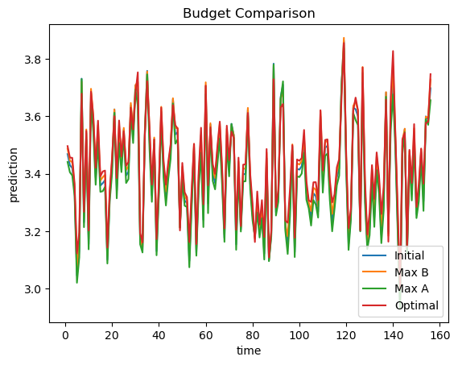

# Optimizer
Matthew Reda

<!-- WARNING: THIS FILE WAS AUTOGENERATED! DO NOT EDIT! -->

------------------------------------------------------------------------

<a
href="https://github.com/redam94/budget_optimizer/blob/main/budget_optimizer/optimizer.py#L24"
target="_blank" style="float:right; font-size:smaller">source</a>

### Optimizer

>  Optimizer (model:budget_optimizer.utils.model_classes.BaseBudgetModel,
>                 config_path:str|pathlib.Path)

*Optimizer wrapper for the pyswarms package*

<table>
<thead>
<tr>
<th></th>
<th><strong>Type</strong></th>
<th><strong>Details</strong></th>
</tr>
</thead>
<tbody>
<tr>
<td>model</td>
<td>BaseBudgetModel</td>
<td>The model to optimize</td>
</tr>
<tr>
<td>config_path</td>
<td>str | pathlib.Path</td>
<td>Path to the configuration files</td>
</tr>
</tbody>
</table>

``` python
class BudgetModel(BaseBudgetModel):
    """
    Budget model class
    """
    ...
```

``` python
m = BudgetModel("Revenue Model", "Revenue", "../example_files/model_1")
```

``` python
init_budget = np.array([2, 3])
bounds = [(1, 3), (2, 4)]
constraints = opt.LinearConstraint([[1, 1]], [5], [5])
o = Optimizer(m, "../example_files")
```

------------------------------------------------------------------------

<a
href="https://github.com/redam94/budget_optimizer/blob/main/budget_optimizer/optimizer.py#L70"
target="_blank" style="float:right; font-size:smaller">source</a>

### Optimizer.optimize

>  Optimizer.optimize (init_pos:numpy.ndarray,
>                          bounds:list[tuple[float,float]], constraints:None|sci
>                          py.optimize._constraints.LinearConstraint=None)

*Optimize the model*

<table>
<colgroup>
<col style="width: 6%" />
<col style="width: 25%" />
<col style="width: 34%" />
<col style="width: 34%" />
</colgroup>
<thead>
<tr>
<th></th>
<th><strong>Type</strong></th>
<th><strong>Default</strong></th>
<th><strong>Details</strong></th>
</tr>
</thead>
<tbody>
<tr>
<td>init_pos</td>
<td>ndarray</td>
<td></td>
<td>Initial position of the optimizer</td>
</tr>
<tr>
<td>bounds</td>
<td>list</td>
<td></td>
<td>Bounds for the optimizer</td>
</tr>
<tr>
<td>constraints</td>
<td>None | scipy.optimize._constraints.LinearConstraint</td>
<td>None</td>
<td>Constraints for the optimizer</td>
</tr>
</tbody>
</table>

``` python
o_fitted = o.optimize(init_budget, bounds, constraints)
```

               message: `xtol` termination condition is satisfied.
               success: True
                status: 2
                   fun: -534.6244813962205
                     x: [ 1.452e+00  3.548e+00]
                   nit: 72
                  nfev: 216
                  njev: 72
                  nhev: 0
              cg_niter: 60
          cg_stop_cond: 1
                  grad: [-3.049e+01 -3.049e+01]
       lagrangian_grad: [ 5.554e-07 -5.554e-07]
                constr: [array([ 5.000e+00]), array([ 1.452e+00,  3.548e+00])]
                   jac: [array([[ 1.000e+00,  1.000e+00]]), array([[ 1.000e+00,  0.000e+00],
                               [ 0.000e+00,  1.000e+00]])]
           constr_nfev: [0, 0]
           constr_njev: [0, 0]
           constr_nhev: [0, 0]
                     v: [array([ 3.049e+01]), array([-2.949e-06,  2.949e-06])]
                method: tr_interior_point
            optimality: 5.554321243744045e-07
      constr_violation: 0.0
        execution_time: 0.47835206985473633
             tr_radius: 1.0000000000000005e-09
        constr_penalty: 1.0
     barrier_parameter: 2.048000000000001e-09
     barrier_tolerance: 2.048000000000001e-09
                 niter: 72

    Optimal budget:
    {'a': np.float64(1.45), 'b': np.float64(3.55)}


