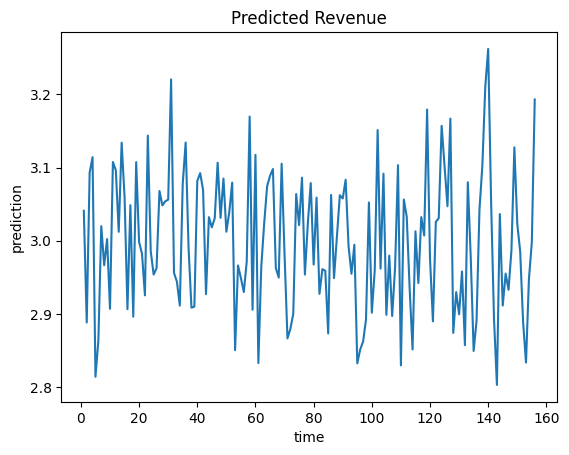
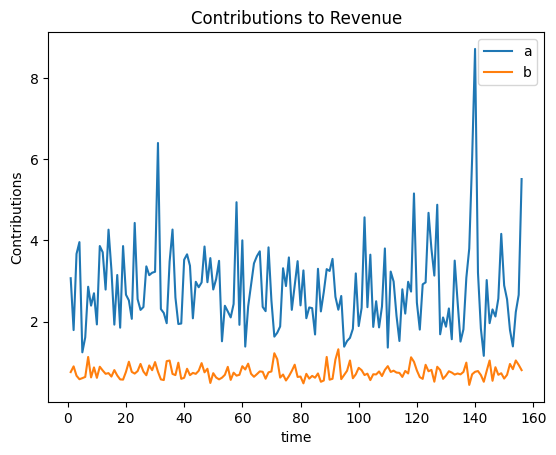

# Model Classes
Matthew Reda

<!-- WARNING: THIS FILE WAS AUTOGENERATED! DO NOT EDIT! -->

------------------------------------------------------------------------

<a
href="https://github.com/redam94/budget_optimizer/blob/main/budget_optimizer/utils/model_classes.py#L28"
target="_blank" style="float:right; font-size:smaller">source</a>

### BaseBudgetModel

>  BaseBudgetModel (model_name:str, model_kpi:str,
>                       model_path:str|pathlib.Path)

*Abstract class for all models*

<table>
<colgroup>
<col style="width: 9%" />
<col style="width: 38%" />
<col style="width: 52%" />
</colgroup>
<thead>
<tr>
<th></th>
<th><strong>Type</strong></th>
<th><strong>Details</strong></th>
</tr>
</thead>
<tbody>
<tr>
<td>model_name</td>
<td>str</td>
<td>Name used to identify the model</td>
</tr>
<tr>
<td>model_kpi</td>
<td>str</td>
<td>Key performance indicator output by the model predict</td>
</tr>
<tr>
<td>model_path</td>
<td>str | pathlib.Path</td>
<td>Path to the model artifact</td>
</tr>
</tbody>
</table>

``` python
class BudgetModel(BaseBudgetModel):
    """
    Budget model class
    """
    ...
```

``` python
m = BudgetModel("Revenue Model", "Revenue", "../../example_files/fast_model")
```

------------------------------------------------------------------------

<a
href="https://github.com/redam94/budget_optimizer/blob/main/budget_optimizer/utils/model_classes.py#L68"
target="_blank" style="float:right; font-size:smaller">source</a>

### BaseBudgetModel.predict

>  BaseBudgetModel.predict
>                               (budget:Union[Dict[str,float],xarray.core.datase
>                               t.Dataset])

*Predict the target variable from the input data*

<table>
<thead>
<tr>
<th></th>
<th><strong>Type</strong></th>
<th><strong>Details</strong></th>
</tr>
</thead>
<tbody>
<tr>
<td>budget</td>
<td>Union</td>
<td>Budget</td>
</tr>
<tr>
<td><strong>Returns</strong></td>
<td><strong>DataArray</strong></td>
<td><strong>Predicted target variable</strong></td>
</tr>
</tbody>
</table>

``` python
budget = {"a": 2, "b": .3}
prediction = m.predict(budget)
```



------------------------------------------------------------------------

<a
href="https://github.com/redam94/budget_optimizer/blob/main/budget_optimizer/utils/model_classes.py#L79"
target="_blank" style="float:right; font-size:smaller">source</a>

### BaseBudgetModel.contributions

>  BaseBudgetModel.contributions
>                                     (budget:Union[Dict[str,float],xarray.core.
>                                     dataset.Dataset])

*Get the contributions of the input data to the target variable*

<table>
<colgroup>
<col style="width: 9%" />
<col style="width: 38%" />
<col style="width: 52%" />
</colgroup>
<thead>
<tr>
<th></th>
<th><strong>Type</strong></th>
<th><strong>Details</strong></th>
</tr>
</thead>
<tbody>
<tr>
<td>budget</td>
<td>Union</td>
<td>Budget</td>
</tr>
<tr>
<td><strong>Returns</strong></td>
<td><strong>Dataset</strong></td>
<td><strong>Contributions of the input data to the target
variable</strong></td>
</tr>
</tbody>
</table>

``` python
contributions = m.contributions(budget)
```


